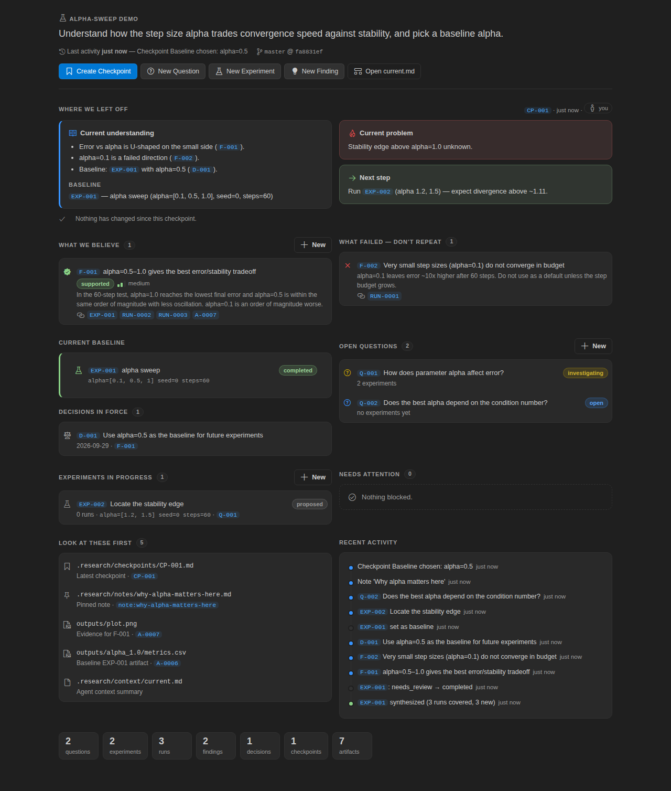

# Research Panel

A VS Code extension and CLI that act as a **research memory layer** for computational projects. Research Panel keeps the chain

```
question → experiment → runs → artifacts/metrics → findings → decisions → checkpoint
```

so that when you come back after a month, or after an agent ran 40 jobs, you can see within two minutes:

- what was tried, and why
- what worked and what failed
- what the project currently believes, and on what evidence
- where the files are
- where to continue

📘 **Full technical specification:** [`docs/SPEC.md`](docs/SPEC.md) covers the data model, storage format, sync and rebuild algorithms, state machines, run budget, runner and SLURM protocol, CLI, Python API, RPC and every UI view.

It is not an experiment tracker or a dashboard. Runs stay in the background, and findings, decisions and checkpoints are what the UI puts first.

<p align="center"></p>

More screens: [experiment detail](docs/screens/experiment.png) · [finding](docs/screens/finding.png) · [run form](docs/screens/form_run.png) · [sidebar overview](docs/screens/overview.png) · [in VS Code: sidebar](docs/screens/vscode-sidebar.png) · [in VS Code: experiment + terminal run](docs/screens/vscode-experiment-terminal.png)

---

## Contents

[What this is](#what-this-is) · [Installation](#installation) · [Quick start](#quick-start) · [Core concepts](#core-concepts) · [Using the VS Code panel](#using-the-vs-code-panel) · [Using the CLI](#using-the-cli) · [Agent workflow](#agent-workflow) · [Experiment protocol](#experiment-protocol) · [Skills & context management](#skills--context-management) · [SLURM setup](#slurm-setup) · [Remote SSH usage](#remote-ssh-usage) · [Backup & version control](#backup--version-control) · [Troubleshooting](#troubleshooting) · [Development](#development)

---

## What this is

| Piece | What it does |
|---|---|
| **`.research/`** in each project | All state for that project: Markdown/YAML files you can read and edit, run directories, an append-only audit log, and a SQLite index that is rebuilt automatically. Nothing is stored globally and nothing goes to the cloud. |
| **Python core + `research` CLI** (`packages/core`, `packages/cli`) | All of the business logic. It uses only the standard library, needs Python ≥ 3.8, and doesn't depend on PyTorch, ML libraries or any particular kind of project. |
| **VS Code extension** (`packages/vscode-extension`) | UI only. It bundles the Python core and talks to it over stdio JSON-RPC. It runs on whichever machine holds the files, including the HPC login node when you use Remote SSH. |

Why a Python core rather than TypeScript only: agents and your own scripts log from Python (`research.log_metric(...)`), HPC nodes always have `python3`, and native SQLite modules inside a VSIX are a portability problem. The cost is one extra process boundary, and bundling the core keeps it to that. Details are in [`docs/SPEC.md`](docs/SPEC.md) and [`docs/DESIGN.md`](docs/DESIGN.md).

## Installation

### From the built artifacts (`dist/`)

```bash
# VS Code extension (the Python core is bundled; no pip install needed for the panel)
code --install-extension dist/research-panel-0.1.0.vsix
#   or: VS Code → Extensions → ⋯ → Install from VSIX…

# Optional: the `research` CLI outside VS Code (e.g. on HPC, in sbatch scripts, in notebooks)
pip install dist/research_panel-0.1.0-py3-none-any.whl      # or: pip install .   /   pip install -e .
```

Inside VS Code terminals, `research` is already on `PATH` because the extension adds a small shim, so you and any agents running in those terminals can use it without installing anything.

**Remote SSH:** install the VSIX once. VS Code puts workspace extensions on the remote host automatically. If it asks, choose "Install in SSH: <host>".

### Upgrade

Build or download the newer VSIX and run `code --install-extension research-panel-X.Y.Z.vsix --force`. For the CLI, run `pip install -U dist/research_panel-X.Y.Z-*.whl`, or just `git pull` if you used `pip install -e .`. The `.research/` format is versioned and migrations run automatically. An older tool will refuse to open a newer project rather than damage it.

### Uninstall

Run `code --uninstall-extension research-local.research-panel` and `pip uninstall research-panel`. Your projects' `.research/` folders are left untouched.

## Quick start

```bash
cd my-project
research init --goal "Recover physically plausible material maps from CT without paired supervision"
research question create "Can entropy regularization reduce material mixing?"
research experiment create "entropy weight sweep" -q Q-001 \
  --hypothesis "λ≈1e-3 reduces mixing entropy with <2% CT-MAE cost" \
  --param entropy_weight=1e-3 --metric ct_mae --planned-runs 3 --stop "3 runs, then synthesize"
research run exec EXP-001 --param entropy_weight=1e-3 -- python train.py --entropy 1e-3
research run submit EXP-001 --time 04:00:00 --gpus 1 -- python train.py --entropy 3e-3     # SLURM
research artifact add outputs/entropy_plot.png --run RUN-0001 -d "entropy vs epoch"
research experiment synthesize EXP-001 --happened "…" --interpretation "…" --next "…"
research finding create "λ≈1e-3 reduces mixing at <2% MAE cost" --supports EXP-001 RUN-0001 A-0001 \
  --confidence medium --limitations "only 5 validation subjects"
research decision create "Use entropy_weight=1e-3 as baseline" --findings F-001
research checkpoint --problem "Spectral calibration test failing" --next "Projection-space loss ablation"
research resume
```

In VS Code, the same flow is **Research: Initialize Project**, followed by the buttons in the Research sidebar. The demo project `bash examples/alpha-sweep/run_demo.sh` builds a complete example (question → sweep → 3 runs → plot → finding + failed direction → decision → baseline → variant → note → checkpoint).

## Core concepts

| Entity | ID | What it is |
|---|---|---|
| **Question** | `Q-001` | What you are trying to understand. Questions can have sub-questions. Statuses: open, investigating, answered, blocked, abandoned. |
| **Experiment** | `EXP-001` | A *designed test*: hypothesis, motivation, method, expected outcome, success criteria, stop conditions, parameters, requested metrics and expected artifacts. It records the git branch, commit and dirty state when it is registered. A **variant** copies the design and records a parameter **delta** (`entropy_weight: 1e-3 → 3e-3`). |
| **Run** | `RUN-0001` | One execution, which always belongs to an experiment. It records the command, working directory, parameters, backend, host, SLURM job, start and end times, exit code, logs, git state, and a `git.diff` if the tree was dirty. |
| **Artifact** | `A-0001` | A *reference* to any file or directory (a plot, CSV, NPY, NIfTI, checkpoint, log…). Nothing is copied. Paths are stored relative to the project when possible and absolute otherwise, together with size, mtime and an optional sha256. |
| **Metric** | — | A number or text value attached to a run or an experiment, with optional step and unit. No ML assumptions are built in. |
| **Synthesis** | `EXP-001/S1` | The interpretation of an experiment's runs: what happened, what worked, what failed, interpretation, limitations, unresolved questions, recommended next step. Creating a synthesis does not create findings automatically. |
| **Finding** | `F-001` | **The most important object.** A reusable, interpreted result with evidence (`supports` / `contradicts` → experiments, runs, artifacts), confidence and limitations. Its kind is `result` or `failure` ("don't repeat this"), and its status is preliminary, supported, contradicted or superseded. |
| **Decision** | `D-001` | A deliberate choice based on findings, such as a new baseline. It can be active, reversed or superseded. |
| **Checkpoint** | `CP-001` | A snapshot of the project's understanding: goal, current understanding, baseline, important findings, known failures, open questions, what is broken, the next step, and the git branch and commit. It is pre-filled from the current state. |
| **Note** | `note:slug` | *Your* Markdown notes in `.research/notes/`. They can be pinned and linked to other objects. Agents are told not to write them. |

**Authorship.** Every object records `author_type` (`human` / `agent` / `system`), plus the agent's name and model when there is one. Claude Code is detected automatically through `CLAUDECODE=1`. For other agents, set `RESEARCH_AGENT=codex` or pass `--agent codex`. Actions taken in the VS Code UI are always recorded as human. The UI marks agent-written syntheses and findings with a purple badge.

**IDs** accept loose input: `exp-1`, `EXP1` and `1` (where the type is obvious) all resolve to `EXP-001`.

### What's on disk

```
AGENTS.md                         ← only the block between <!-- research:begin/end --> is managed
.research/
├── config.yaml                   ← project goal, agent_policy (run budgets), SLURM defaults
├── questions/Q-001.md            ← Markdown + YAML front-matter; EDIT FREELY
├── experiments/EXP-001.md        ← editable design + generated runs table/synthesis (below a marker)
├── findings/  decisions/  checkpoints/
├── runs/RUN-0001/                ← run.json, status.json, stdout.log, stderr.log, metrics.jsonl, git.diff, job.sbatch
├── artifacts.jsonl  syntheses.jsonl  metrics.jsonl  events.jsonl   ← append-only records
├── notes/  skills/  prompts/  templates/  context/current.md
├── research.db                   ← SQLite index (git-ignored, rebuilt automatically)
└── cache/
```

**Editing by hand is supported.** Change a title, a status, a front-matter list or any `## Section` in a mirror file, and the change is imported on the next sync (any CLI call, a panel refresh, or the file watcher), then logged as `edited`. You can also drop a new `findings/my-idea.md` into the folder and it gets imported with a new ID. A malformed file never corrupts the index: it is reported and skipped. Everything below the `<!-- research:generated … -->` marker is regenerated.

## Using the VS Code panel

**Activity bar → Research** (flask icon):

| View | Contents |
|---|---|
| **Overview** | The goal, a **Resume Project** button, the latest checkpoint (problem → next step), items needing attention (experiments to synthesize, active runs), active questions, current experiments, latest findings and decisions. |
| **Questions** | Questions in a hierarchy, with their experiments nested underneath. |
| **Experiments** | Grouped into In progress / Completed / Failed. Runs are **collapsed** under each experiment, and artifacts sit under their runs. Experiments that need synthesis show ⚠. The view badge shows the count. |
| **Findings** | Established, Preliminary, Failed directions, and Contradicted & superseded. |
| **Decisions / Checkpoints / Notes / Artifacts** | Lists of each; Notes, Artifacts and Checkpoints start collapsed. |
| **Agent Context** | `AGENTS.md`, `config.yaml`, Skills (with descriptions), Project context, Prompts and Templates. |

**Resume Project** (`Cmd/Ctrl+Alt+R`, or click the status-bar item) is the main screen. It shows the goal, when and by whom the project was last touched, and the branch and commit. Below that are:

- **Where we left off**: current understanding, the current problem, the next step, and what changed since the checkpoint
- **What we believe** and **What failed — don't repeat**
- **Current baseline** and **Decisions in force**
- **Open questions**, **Experiments in progress** and **Needs attention**
- **Look at these first**: the checkpoint, pinned notes, artifacts cited as evidence, and baseline outputs
- **Recent activity**

Every ID is clickable. Alt-click opens it beside the current editor.

**Detail pages**

- **Experiment:** the design (hypothesis, success criteria, stop conditions), parameters with the delta from its parent, a runs table (parameters × metrics, best value highlighted, bar charts per metric), an artifact gallery with image thumbnails, syntheses (agent- and human-written ones are visibly different), findings produced, and an activity timeline. Actions: **Run…**, **Attach run**, **Synthesize**, **Finding**, **Variant**, Status (complete, fail, set baseline), Edit, Open Markdown and Terminal here.
- **Finding:** the statement, evidence (with images inline), contradicting evidence, limitations, experiments, decisions based on it, and history.
- **Run:** the command (copyable), parameters, metrics, SLURM info, artifacts, and the tail of stdout and stderr.
- **Artifact:** previews for images, Markdown and text, pretty-printed JSON, CSV/TSV tables, NPY headers and directory listings. Other formats show metadata with Open, Reveal and Copy path. Adapters live in `panels.ts` (`PREVIEW_ADAPTERS`).

**Forms** for creating things have entity pickers (type an ID or search), key/value parameter editors (a variant highlights what changed), segmented status controls, and `Cmd/Ctrl+Enter` to save.

**Running from the UI** (Run… on an experiment):

| Mode | What happens |
|---|---|
| **Terminal** (default) | Opens an integrated terminal and runs `research run exec …` there, so you see live output. |
| **Background** | Starts a detached process that survives closing VS Code. |
| **SLURM** | Submits with `sbatch`. The form includes partition, time, GPUs, memory, CPUs, account and extra `#SBATCH` lines. |

If the experiment has hit its run budget, the UI suggests synthesizing first. You can still override, and the override is logged.

**Also:**

- Explorer → right-click a file → **Register as Research Artifact**.
- The **file watcher** refreshes the panel whenever an agent changes `.research/` from a terminal.
- **Status bar** shows the project name, active runs and ⚠ experiments needing synthesis.

**Settings:**

| Setting | Controls |
|---|---|
| `research.pythonPath` | Python used to run the bundled core. Empty means auto-detect `python3`. |
| `research.terminalCommand` | Whether the `research` shim is added to terminals. |
| `research.defaultRunMode` | Default mode for Run… (terminal, background or slurm). |
| `research.pollIntervalSeconds` | How often run status is refreshed while runs are active. |
| `research.projectRoot` | Explicit project root, if auto-detection picks the wrong folder. |

## Using the CLI

```text
research init [--name] [--goal]              research status | resume | context [--print] | log
research show <ID>                           research mark <ID> <status> [--reason]
research project set --goal "…"

research question  create|list|update|show   (alias: q)
research experiment create|list|show|update|variant|synthesize|baseline
                    |start|ready|review|complete|fail|abandon|run      (aliases: exp, e)
research run   exec|submit|attach|list|status|update|cancel|logs|sync (alias: r)
research metric add NAME VALUE --run RUN-… | --experiment EXP-…
research artifact add PATH… [--run|--experiment] [-d "…"]  |  list
research finding  create|list|update|supersede|show   (alias: f)
research decision create|list|update                   (alias: d)
research checkpoint [create] | list | show | draft     (alias: cp)
research note new|list|pin|link    research skills list|new|duplicate    research agents-md
research sync       # import hand edits, ingest job outputs, refresh run status
research rebuild    # rebuild research.db from the text files (backup kept in .research/cache)
```

- Every command accepts `--json`.
- Commands after `--` are passed through untouched: `research run exec EXP-001 --param lr=3e-4 -- python train.py --lr 3e-4`.
- `--param k=v` values are parsed as `3e-4` (number), `true` (bool), `[0.1,0.5]` (list) or text.
- **Exit codes:** `0` ok · `1` error · `2` not initialized · **`3` blocked by run budget/policy** · `4` not found.

**Python API** (same core):

```python
import research
research.get_resume_context()            # == research.get_project_context()
q = research.create_question("How does Krylov dimension affect observable error?")
e = research.create_experiment("krylov sweep", question=q["id"], hypothesis="…", parameters={"m": [10, 20, 40]})
r = research.create_run(e["id"], command="julia run.jl --m 10", parameters={"m": 10})   # register only
research.log_metric("obs_error", 3.2e-4, run=r["id"])
research.register_artifact("figs/error_vs_m.png", experiment=e["id"], description="…")
research.synthesize(e["id"], what_happened="…", interpretation="…")
research.create_finding("m=20 suffices for 1e-4 error", supports=[e["id"]], confidence="medium")
research.create_decision("Use m=20 by default", supporting_findings=["F-001"])
research.create_checkpoint(current_problem="…", next_experiment="…")
```

Inside a run started with `research run exec` or `submit`, you can call `research.log_metric("loss", x, step=i)` and `research.register_artifact(path)` without any IDs. They attach to the current run by writing only into the run directory, which makes them safe on compute nodes. The login node picks the values up on the next sync.

## Agent workflow

`research init` writes a managed block into **`AGENTS.md`**. Claude Code, Codex and similar tools read this file, and the block tells them:

1. Read `.research/context/current.md` before doing anything substantial. It is a short, regenerated summary covering the goal, checkpoint, baseline, beliefs, failed directions, current experiments, blockers and policy.
2. Register an experiment before any substantial computation. Runs belong to experiments, and no experiment should be invisible.
3. Respect the **run budget**, which is enforced (see below).
4. Register important artifacts. Synthesize before starting follow-ups. Record reusable results as findings and deliberate choices as decisions. Checkpoint at major stopping points.
5. Never rewrite history silently. Supersede instead. Every change is logged in `events.jsonl`.
6. Don't write the human's notes.

**Run budget / anti-sprawl** (`.research/config.yaml`):

```yaml
agent_policy:
  max_runs_without_synthesis: 5       # after 5 finished runs, `research run …` exits 3 until you synthesize
  max_failed_runs_without_review: 3   # 3 failed runs → stop and look
  require_experiment_registration: true
  require_synthesis_before_new_experiment: true
  enforce_for_humans: false           # humans get warnings; set true to enforce for yourself too
```

Enforcement applies when the author is an agent. `--override "reason"` bypasses a block and logs the reason. The panel flags **Needs synthesis · N unsynthesized runs** on the experiment, in the tree, on the view badge and in the status bar.

A useful opening prompt for agents is `.research/prompts/resume-session.md`.

## Experiment protocol

Substantial work follows **UNDERSTAND → PLAN → REGISTER → IMPLEMENT → SANITY CHECK → RUN → COLLECT EVIDENCE → SYNTHESIZE → STOP / PROPOSE**. Registration must cover the question, hypothesis, reason, expected result, evaluation criteria, planned runs, required artifacts and stop conditions (`research experiment create --help`).

**Paper reproduction** (`.research/skills/reproduce-paper/SKILL.md`):

1. Understand: claims, datasets, dependencies, unknowns. No execution yet.
2. Plan: one question per claim, and proposed experiments with explicit tolerances.
3. Implement: code plus unit tests, with no sweeps.
4. Sanity run on the smallest configuration.
5. Reproduction runs, limited to what was planned.
6. Synthesis: findings compared against the paper, with deviations listed under limitations.
7. Stop and propose follow-ups instead of launching them.

**Data cleaning** (`skills/clean-dataset`): the question is "can X be made analysis-ready?". The experiment is the pipeline run on a sample first. Artifacts are the cleaned dataset, a validation report, an exclusion list and summary statistics. Findings record what was excluded and why.

## Skills & context management

`.research/skills/<name>/SKILL.md` are ordinary skill folders (front-matter `name`, `description`, and optional `scripts/`). Four defaults are installed: `run-experiment`, `synthesize-experiment`, `reproduce-paper` and `clean-dataset`. You can create and duplicate skills from the Agent Context view or with `research skills new|duplicate`. `prompts/` and `templates/` are yours to fill.

`context/current.md` is regenerated after every change. If your agent expects skills somewhere else, such as `.claude/skills`, a symlink works: `ln -s ../.research/skills .claude/skills`.

## SLURM setup

Defaults go in `.research/config.yaml`:

```yaml
backends:
  slurm:
    partition: gpu-common
    account: mylab
    time: "04:00:00"
    gpus: 1            # → --gres=gpu:1   (or "a100:1")
    mem: 32G
    cpus: 8
    extra_args: ["--constraint=a100"]
    setup:             # run before the command in every job
      - module load cuda/12.1
      - source ~/miniconda3/etc/profile.d/conda.sh && conda activate myenv
```

`research run submit EXP-003 --time 01:00:00 -- python train.py` writes `.research/runs/RUN-XXXX/job.sbatch` and submits it with `sbatch --parsable`. Inside the job, `research.runner` records hostname, node list, start and end times and exit code into `status.json` and captures `stdout.log` and `stderr.log`.

Status is reconciled from, in order:

1. the files in the run directory
2. `squeue`
3. `sacct`, which also covers jobs killed by TIMEOUT or out-of-memory before the runner could finish

Compute nodes never touch SQLite, which matters because SQLite locking is unreliable on NFS and Lustre. Cancel a job with `research run cancel RUN-XXXX` (runs `scancel`). SLURM is optional, and local runs work without it.

## Remote SSH usage

```
Mac (VS Code UI) ── Remote SSH ──▶ HPC login node
                                   ├─ extension host → python3 -m research.rpc (bundled core)
                                   ├─ repo/.research/, git, sbatch/squeue/sacct
                                   └─ compute nodes → research.runner writes only its run dir
```

- The extension declares `extensionKind: ["workspace"]`, so it runs **on the remote host**, and so does every file access, git call, SQLite query and SLURM command. Images in webviews are streamed from the remote machine.
- Remote SSH needs Python ≥ 3.8 on the login node. If `python3` there is too old, set `research.pythonPath` in the *Remote* settings, for example to a conda env's python.
- Detached and SLURM runs keep going when your laptop sleeps. Status catches up when you reconnect.
- Tested via code-server, which uses the same split-host architecture: see [Development](#development).

## Backup & version control

- **Commit `.research/`** (its `.gitignore` already excludes `research.db`, `cache/` and run logs). Everything except the index is plain text and diffs cleanly, and a fresh clone rebuilds the index on first use.
- If you want logs versioned, remove the `runs/*/stdout.log` lines from `.research/.gitignore`.
- Large artifacts are not copied. Back them up wherever they live, since `.research/` only references them.
- **ID collisions after merging branches:** if two branches both created `EXP-012`, `research rebuild` reports a conflict event. Renaming one of the files (for example to `EXP-013.md`) and fixing its `id:` resolves it.
- `research rebuild` recreates the index from the text files at any time and keeps a backup in `.research/cache/`.

## Troubleshooting

| Symptom | Fix |
|---|---|
| Panel says "Could not start Python" | Set `research.pythonPath` (Remote settings under SSH) to a Python ≥ 3.8. Check **Research: Show Log**. |
| `research: command not found` in a terminal | Open a *new* terminal after installing, or check `research.terminalCommand`, or `pip install` the wheel. |
| `exit code 3` from `research run …` | The run budget was reached. Synthesize (`research experiment synthesize EXP-…`), or have a human `--override "reason"`. |
| A run stuck at `running` | `research run status RUN-…` reconciles it. Local runs whose process died become `unknown`, and SLURM runs use `sacct`. |
| Hand edit not showing | Any CLI call or a panel refresh imports it. Malformed YAML is skipped and logged (`research log`). |
| "schema vN newer than this tool" | Upgrade the extension or CLI. The project was written by a newer version. |
| Corrupt or locked `research.db` | Delete it (or run `research rebuild`). It is rebuilt from the text files. |

## Development

```bash
git clone … research-vscode && cd research-vscode
pip install -e ".[dev]"              # `research` CLI in editable mode + pytest
npm install                          # installs extension dev deps (postinstall)
npm run build                        # bundle the extension (esbuild)
npm test                             # 40 Python tests + TypeScript typecheck
npm run package                      # → dist/research-panel-X.Y.Z.vsix, dist/*.whl, dist/*.tar.gz
bash scripts/clean_install_test.sh   # release checklist: fresh venv, full protocol, moved copy, path-leak scan
npm run demo                         # builds examples/alpha-sweep/demo-project
```

- **Run the extension from source:** open `packages/vscode-extension` in VS Code and press F5. The dev build uses `packages/core` directly.
- **UI end-to-end test:** install the VSIX into [code-server](https://github.com/coder/code-server), start it on the demo project, and run `python scripts/e2e_code_server.py <project> <shots-dir>`. It uses Playwright to drive the real UI: sidebar, the new-question form, a run in the terminal, and a live refresh.
- **Real-VS-Code test:** `npm run test:ext` with `RESEARCH_TEST_WORKSPACE=<demo>` installs the VSIX into a downloaded VS Code and runs `packages/vscode-extension/test/harness`. This needs network access to update.code.visualstudio.com.

**Layout:**

| Path | Contents |
|---|---|
| `packages/core/research/` | `schema.py` (entities + migrations), `store.py` (project, mirrors sync, rebuild), `services.py` (entities, budget), `runs.py` (runs, metrics, artifacts, ingestion), `context.py` (resume, checkpoints, current.md), `views.py` (detail views), `rpc.py`, `runner.py`, `backends/` (local, slurm), `templates/` |
| `packages/cli/research_cli/` | argparse CLI |
| `packages/vscode-extension/src/` | `client.ts` (RPC), `model.ts`, `trees.ts`, `panels.ts` (webviews + preview adapters), `commands.ts` (forms), `render/*.ts` (HTML), `shim.ts` (terminal `research`) |
| `tests/python/` | Core, CLI, RPC and mocked-SLURM tests |
| `examples/alpha-sweep/` | Stdlib-only toy simulation + `run_demo.sh` |
